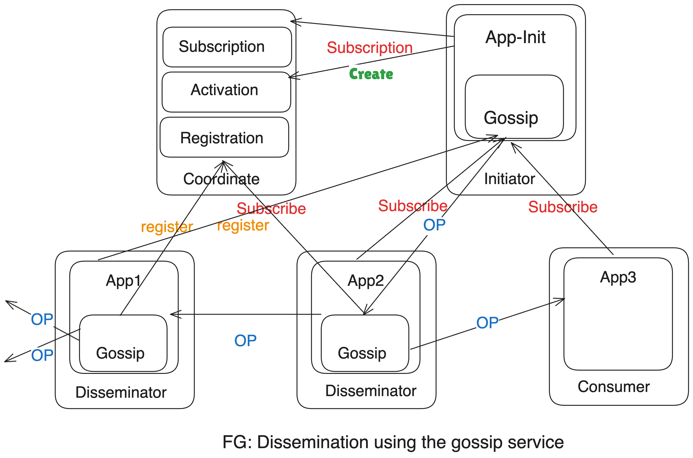

Gossip Dissemination is a communication mechanism used in distributed systems to spread information across nodes in a network in a decentralized and fault-tolerant manner. This approach mimics the way gossip spreads in social networks: each node randomly selects other nodes to share information with, which then repeat the process, ensuring that the information eventually reaches all nodes.

to any regular service that wishes to disseminate any invo- cation or result. **FG** presents an overview of its architecture. There are four different roles:

- Initiator: Initiates the dissemination of some data item. This role requires that the application code (App0b) is changed to use the gossip service and that a compliant middleware stack is used.
- Disseminator: A node that receives a message, sends it to the peers in the list obtained from the Membership service. Although the application code is oblivious to the gossip service, a compliant middleware stack is re- quired.
- Consumer: A node that receives a message, consumes it. This node is completely unchanged and unaffected by the introduction of gossip.
- Coordinator: Besides the Activation and Registration ser- vices from WS–Coordination, these nodes manage the subscription list.

## Types of Gossip Protocols:
**1. Push-based Gossip** 
- Nodes actively push information to other nodes during each round of communication.
 
**2. Pull-based Gossip:**
- Nodes pull information from other nodes, requesting updates to their state.

**3. Push-Pull Gossip:**
- A combination of both push and pull strategies, where nodes exchange information in both directions.

## Problem & Solution Addressed By Gossip Protocol
**Problem**: In a cluster of nodes, each node needs to pass metadata information it has, to all the other nodes in the cluster, without depending on a shared storage. In a large cluster, if all servers communicate with all the other servers, a lot of network bandwidth can be consumed. Information should reach all the nodes even when some network links are experiencing issues.

**Solution**: Cluster nodes use gossip style communication to propagate state updates. Each node selects a random node to pass the information it has. This is done at a regular interval, say every 1 second. Each time, a random node is selected to pass on the information.

## Examples of Projects Uses Gossip Protocol
Gossip protocols are widely used in various distributed systems and blockchain projects to ensure efficient and reliable communication across decentralized networks. 

### 1. **Bitcoin**
   - **Role of Gossip:** Bitcoin uses a form of Gossip protocol to propagate transactions and blocks across the network. When a node receives a new transaction, it gossips the transaction to its peers, ensuring the transaction spreads rapidly across the entire network.
   - **Impact:** This approach ensures that all nodes in the Bitcoin network eventually receive and validate the same set of transactions and blocks, maintaining network consistency.

### 2. **Ethereum**
   - **Role of Gossip:** Similar to Bitcoin, Ethereum uses Gossip protocols to disseminate transactions and newly mined blocks. This protocol is crucial for maintaining the decentralized and trustless nature of the network.
   - **Impact:** Gossiping helps Ethereum nodes quickly reach consensus on the state of the blockchain, contributing to the platform's scalability and security.

### 3. **Apache Cassandra**
   - **Role of Gossip:** Cassandra, a distributed NoSQL database, uses Gossip protocols to maintain and share state information among nodes in a cluster. Each node regularly gossips information about itself and other nodes, such as node status and data ownership.
   - **Impact:** Gossiping enables Cassandra to achieve high availability and fault tolerance, allowing it to scale efficiently across many nodes without a single point of failure.

### 4. **HashiCorp Consul**
   - **Role of Gossip:** Consul, a service mesh solution, uses Gossip protocols to manage membership information and detect node failures within a cluster. Nodes gossip to each other to share updates and maintain a consistent view of the cluster's state.
   - **Impact:** This ensures that Consul can quickly detect and respond to changes in the network, making it reliable and highly available for service discovery and configuration management.

### 5. **Hyperledger Fabric**
   - **Role of Gossip:** Hyperledger Fabric, a permissioned blockchain framework, uses a Gossip protocol for block and transaction dissemination within its peer-to-peer network. Nodes gossip transactions and blocks to ensure all peers have the most up-to-date ledger state.
   - **Impact:** Gossiping in Hyperledger Fabric helps maintain the consistency and integrity of the distributed ledger across multiple organizations in a permissioned network.

### 6. **Scuttlebutt**
   - **Role of Gossip:** Scuttlebutt is a peer-to-peer communication protocol used in decentralized social networks like Secure Scuttlebutt. It uses a Gossip-based approach to share and sync updates between peers.
   - **Impact:** This allows users to maintain decentralized, offline-first social networks, ensuring data consistency across peers without central servers.

### 7. **Akka Cluster**
   - **Role of Gossip:** Akka, a toolkit for building distributed applications on the JVM, uses a Gossip protocol to manage cluster membership and share state information across nodes. Gossiping ensures that each node in an Akka cluster has a consistent view of the cluster's state.
   - **Impact:** This leads to resilient and scalable distributed applications where nodes can join and leave clusters without causing disruptions.
