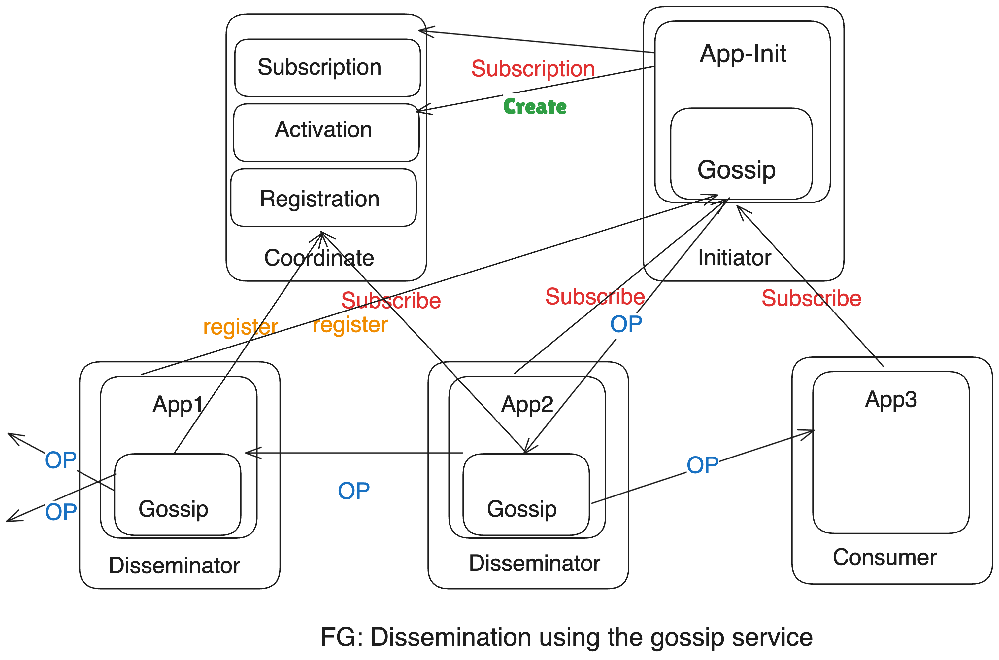

# Gossip-Based-Systems
**In Short: Gossip Dissemination use random selection of nodes to pass on information to ensure it reaches all the nodes in the cluster without flooding the network**
[Read the Document](https://github.com/EncrypteDL/Gossip-Based-Systems/blob/main/Document.md)

## Refrences:
